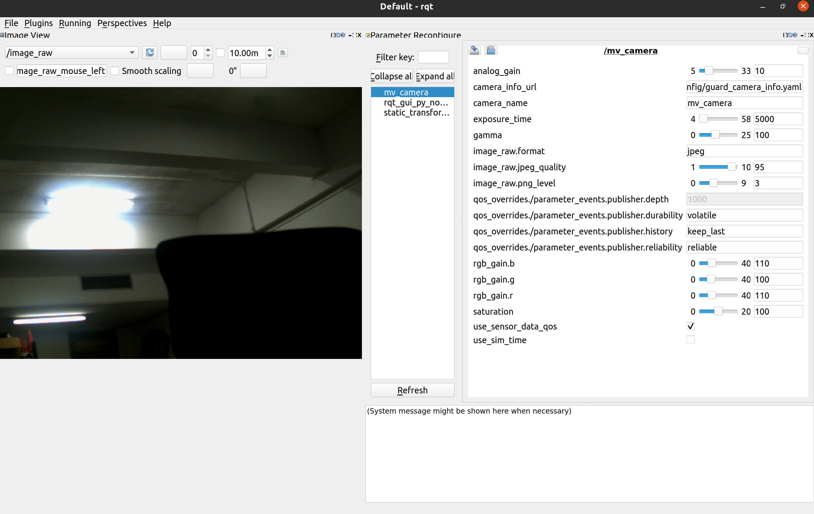

# ros2_mindvision_camera

ROS2 MindVision 相机包，提供了 MindVision 相机的 ROS API。

Only tested under Ubuntu 22.04 with ROS2 Humble

## 使用说明

### Build from source

#### Dependencies

- [Robot Operating System 2 (ROS2)](https://docs.ros.org/en/humble/) (middleware for robotics),

#### Building

To build from source, clone the latest version from this repository into your colcon workspace and compile the package using

	mkdir -p ros_ws/src
	cd ros_ws/src
	git clone https://github.com/chenjunnn/ros2_mindvision_camera.git
	cd ..
	rosdep install --from-paths src --ignore-src -r -y
	colcon build --symlink-install --packages-up-to mindvision_camera

### 标定

标定教程可参考 https://navigation.ros.org/tutorials/docs/camera_calibration.html

参数意义请参考 http://wiki.ros.org/camera_calibration

标定后的相机参数会被存放在 `/tmp/calibrationdata.tar.gz`

### 启动相机节点

    ros2 launch mindvision_camera mv_launch.py

支持的参数：

1. params_file： 相机参数文件的路径 
2. camera_info_url： 相机内参文件的路径
3. use_sensor_data_qos： 相机 Publisher 是否使用 SensorDataQoS (default: `false`)

### 通过 rqt 动态调节相机参数

打开 rqt，在 Plugins 中添加 `Configuration -> Dynamic Reconfigure` 及 `Visualization -> Image View`

